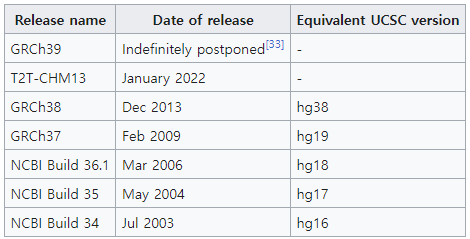

# LiftoverAuto

Genomic data는 reference genome build에 따라서 genomic position이 달라지게 됩니다.

  
*https://en.wikipedia.org/wiki/Reference_genome*

Build에 따라 SNP position이 달라지게 되기 때문에 분석에 사용하는 데이터의 reference genome build를 align 해주는 것은 매우 중요합니다.  
본 repository는 Liftover (Kuhn, 2013)라는 tool을 사용하여 하나의 genome build에서 다른 genome build로 SNP position을 변경하는 script입니다.  
Liftover를 사용하기 전에 따로 *bed*파일을 만들고, 또 Liftover가 끝난 후, SNP matching을 해주어야 하는데, 이러한 부분들을 자동화 해보았습니다.  


---

### **To-do**
- Argument들 log에 저장되게.
- Output 결과 설명
- Intermediate 결과 설명

### **Version control**
*Version 1:*
- Liftover performed with input file without any modification.

---

## How to use?
1. `git clone`을 활용해 관련 script를 다운로드 하기.
```
git clone https://github.com/sanghyeonp/wonlab_share.git
```

2. `/src/liftover_auto/liftover_auto.py`를 이용하여 Liftover 진행.
```
python3 /src/liftover_auto/liftover_auto.py --file <Liftover 수행할 파일> \
                        --build_from <기존 genome build 번호> \
                        --build_to <Lift 할 genome build 번호>
```

<ins>**아래는 현재 구현되어있는 arguments에 대한 설명입니다.**</ins>

- 필수 arguments는 아래와 같습니다.  
`--file` : Path to the input file being lifted over.  
`--build_from` : Genome build number initial. Choices = [18, 37, 38].  
`--build_to` : Genome build number after performing liftover. Choices = [19, 37, 38].

- Input 파일과 관련된 **optional argument**입니다.  
`--delim` : Delimiter used in the input file. Choices = ['tab', 'comma', 'whitespace']. Default = 'tab'.  
`--snp_col` : Name of the SNP column in the input file. Default = 'SNP'.  
`--chr_col` : Name of the chromosome column in the input file. Default = 'CHR'.  
`--pos_col` : Name of the base position column in the input file. Default = 'POS'.

- 중간 결과 파일들 관련된 **optional argument**입니다.  
`--keep_initial_pos` : (flag) Specify to save both previous and lifted Chr and Pos columns. Default = False.  
`--keep_intermediate` : (flag) Specify to keep the intermediate files generated; <>.bed, <>.liftover.lifted, and <>.liftover.unlifted. Default = False.  
`--unlifted_snplist` : (flag) Specify to save the SNP list that has been unlifed. <>.unlifted.snplist. Default = False.  
`--keep_unlifted` : (flag) Specify to retain unlifted SNPs with their base position value as -9. Default = False.  

- 최종 결과 파일들 관련된 **optional argument**입니다.  
`--outf` : Specify the name of the output file. Default = 'lifted.<file>'.  
`--outd` : Specify the path to output directory. Default = Current working directory.  

- Additional **optional arguments**.  
`--verbose` : (flag) Summary 내용을 terminal에서 확인.  

---

## Example

`/example/liftover_auto/` 에 있는 예제를 참고하세요.

GWAS Catalog에 report된 SNP들은 GRCh38로 coding이 되어있는데, 이걸 GRCh37로 바꾸는 예제를 만들어보았습니다.


---
## Contributors
- 김범수 : 처음에 Liftover 사용법 설명해주셨습니다.

---

## Reference
1. Kuhn, R. M., Haussler, D., & Kent, W. J. (2013). The UCSC genome browser and associated tools. Briefings in Bioinformatics, 14(2), 144–161. https://doi.org/10.1093/bib/bbs038
