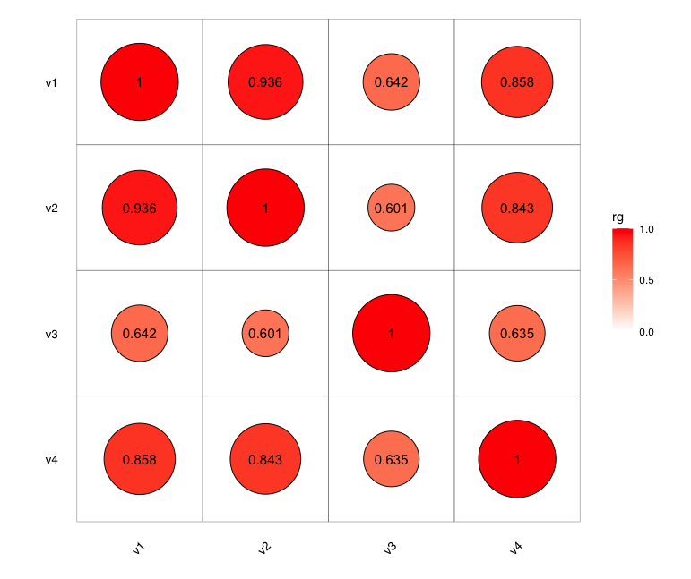

# Visualize specified colors
```
library(scales)
show_col(c("#9C89B8", "#F0A6CA", "#EFC3E6", "#F0E6EF"))
```

# Center the plot by origin
```
library(ggpmisc)

p1 +
  scale_x_continuous(limits = symmetric_limits) +
  scale_y_continuous(limits = symmetric_limits)
```

# Heatmap with circles



```
library(ggplot2)

df <- readRDS("table.heatmap_with_circles.rds")

trait1.list <- unique(df$trait1)
trait2.list <- unique(df$trait2)
trait.list <- unique(c(trait1.list, trait2.list))

df <- rbind(df, df %>% rename(trait1=trait2, trait2=trait1))

df <- rbind(df, data.frame(trait1=trait.list, trait2=trait.list, rg=1, se=NA, Z=NA, P=NA))

df$trait1 <- factor(df$trait1, levels=sort(unique(df$trait1)))
df$trait2 <- factor(df$trait2, levels=rev(sort(unique(df$trait2))))

max_circle_size <- 30
min_rg <- min(abs(df$rg))
ggplot(df, aes(trait1, trait2)) +
    geom_tile(color = "black", fill = NA) +
    geom_point(aes(size = abs(rg), fill = rg), shape = 21, color = "black") +
    geom_text(aes(label = round(rg, 3)), color = "black", size = 4) +
    scale_size_continuous(range = c(max_circle_size*min_rg, max_circle_size), guide = "none") + # Adjust the size range
    scale_fill_gradient2(low = "blue", mid = "white", high = "red", midpoint = 0, 
                         breaks=c(0, 0.5, 1), limits=c(0, 1)) +
    theme_light() +
    labs(x = "", y = "", fill = "rg") +
    theme(axis.text.x = element_text(size=10, angle=45, hjust=1, color="black", family = "Helvetica"),
          axis.text.y = element_text(size=10, color="black", family = "Helvetica"),
          axis.ticks = element_blank(),
          legend.title = element_text(color="black", family = "Helvetica"),
          legend.text = element_text(color="black", family = "Helvetica"),
          panel.grid.major = element_blank(),
          panel.border = element_blank()) +
    coord_fixed(ratio = 1) # Keep the aspect ratio fixed
```
