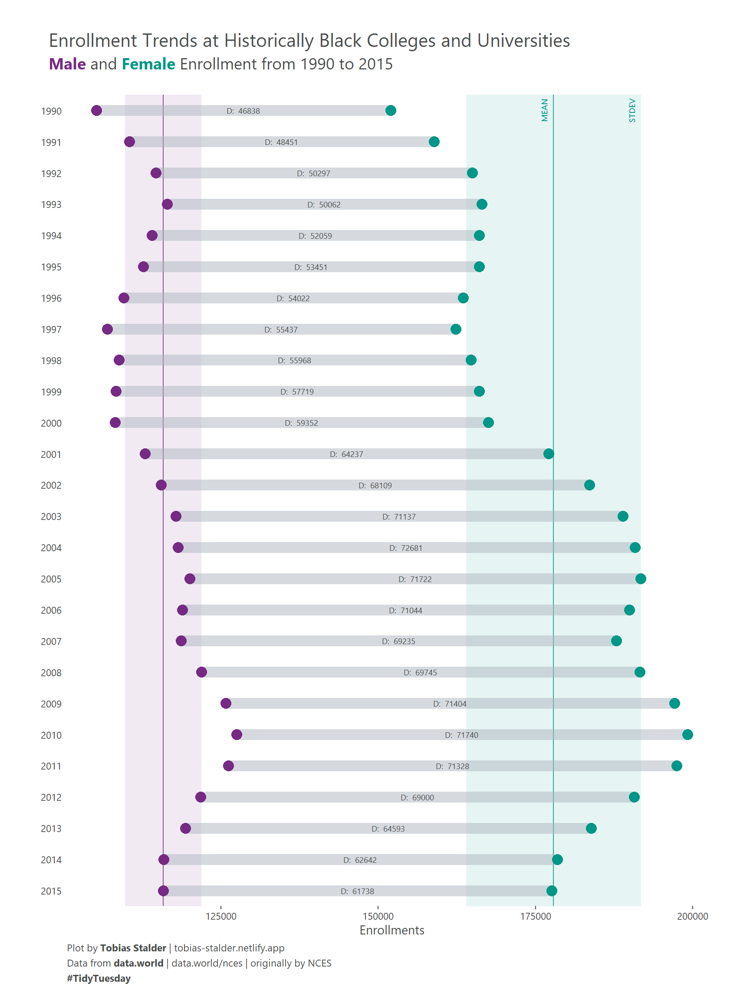

# Visualize specified colors
```
library(scales)
show_col(c("#9C89B8", "#F0A6CA", "#EFC3E6", "#F0E6EF"))
```


# Types of plot
- Dumbbell plot  
References:
  - https://r-graph-gallery.com/web-extended-dumbbell-plot-ggplot2.html



