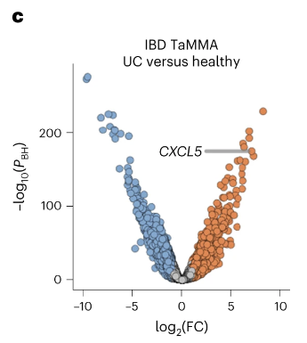
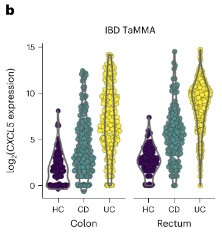
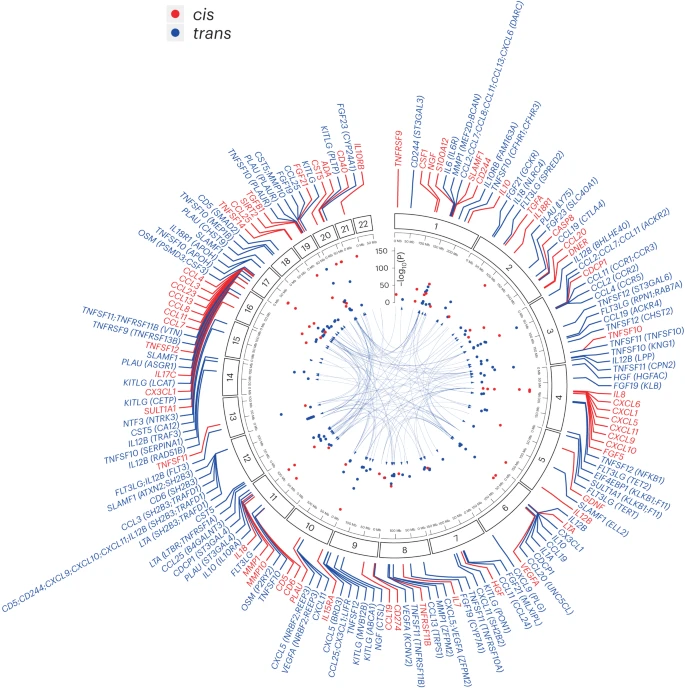
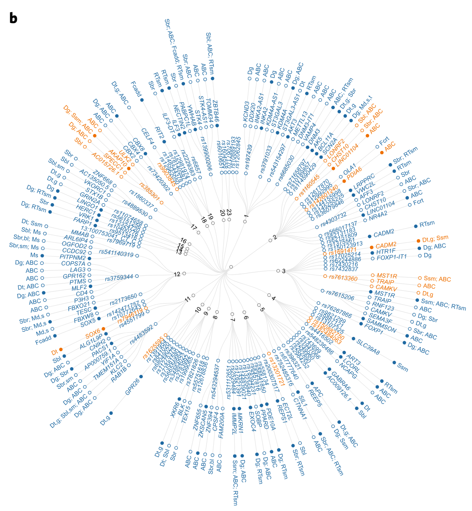
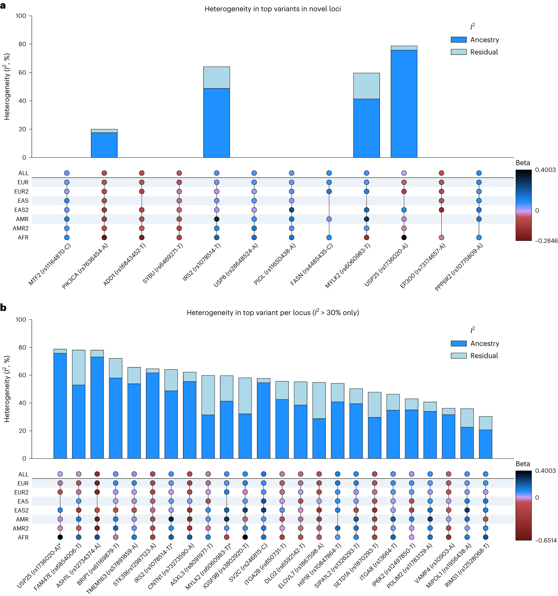
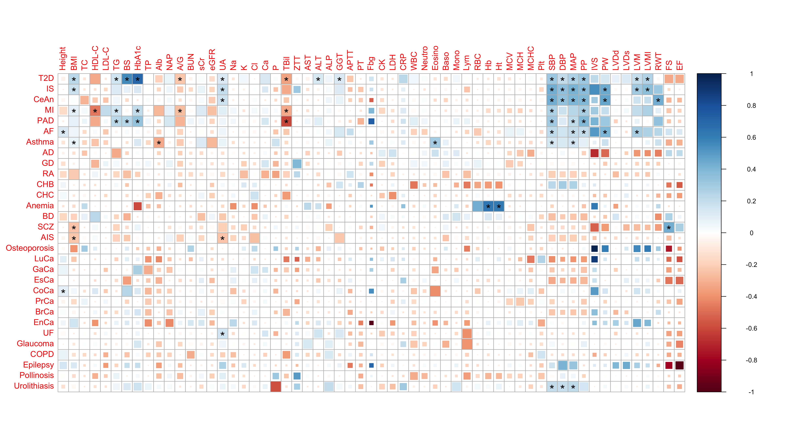

가끔 데이터를 어떻게 표현할지 잘 모르겠거나, 어떤 그림인지는 아는데 이름을 모를 경우를 대비해서 신기한 plot이 보일 때 마다 따로 저장을 해두고 있습니다!

# 여러 plot types 참고 페이지
- https://r-graph-gallery.com/best-r-chart-examples.html

# Volcano plot

- Project:

- Reference:
  - https://www.nature.com/articles/s41590-023-01588-w

# Violin plot

- Project:

- Reference:
  - https://www.nature.com/articles/s41590-023-01588-w

# Circos plot

- Project:

- Reference:
  - https://www.nature.com/articles/s41590-023-01588-w

# Dendogram

- Chromosome에서 어떤 independent signal이 있고, independent signal이 어떤 유전자와 맵핑이 되고, 이 유전자가 어떤 methods로 mapping 되었는지.

- Project:

- Reference:
  - https://www.nature.com/articles/s41588-022-01165-1 

# Heterogeneity upset plot

- Project:

- Reference:
  - https://www.nature.com/articles/s41588-023-01584-8/figures/3

# Forest plot

- Project:
  - Drug repurposing

- Reference: 
  - R package: `forestploter`
  - https://cran.r-project.org/web/packages/forestploter/vignettes/forestploter-intro.html

# Locuszoom plot

- Project:
  - Drug repurposing

- Reference:
  - R package: `locuszoomr`
  - https://cran.r-project.org/web/packages/locuszoomr/vignettes/locuszoomr.html#1_Introduction

# Dumbbell plot  

- References:
  - https://r-graph-gallery.com/web-extended-dumbbell-plot-ggplot2.html

# Corrplot

- Reference:
  - https://github.com/mkanai/ldsc-corrplot-rg

