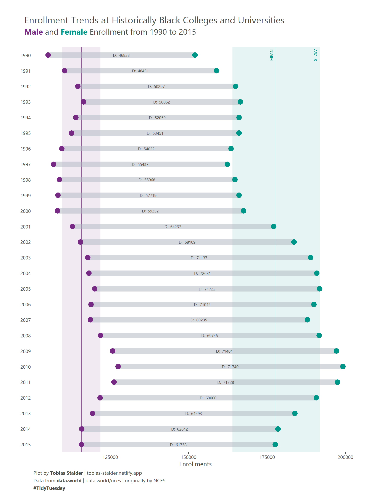

# Forest plot

- Project:
  - Drug repurposing

- Reference: 
  - R package: `forestploter`
  - https://cran.r-project.org/web/packages/forestploter/vignettes/forestploter-intro.html

# Locuszoom plot

- Project:
  - Drug repurposing

- Reference:
  - R package: `locuszoomr`
  - https://cran.r-project.org/web/packages/locuszoomr/vignettes/locuszoomr.html#1_Introduction

# Dumbbell plot  

- References:
  - https://r-graph-gallery.com/web-extended-dumbbell-plot-ggplot2.html

